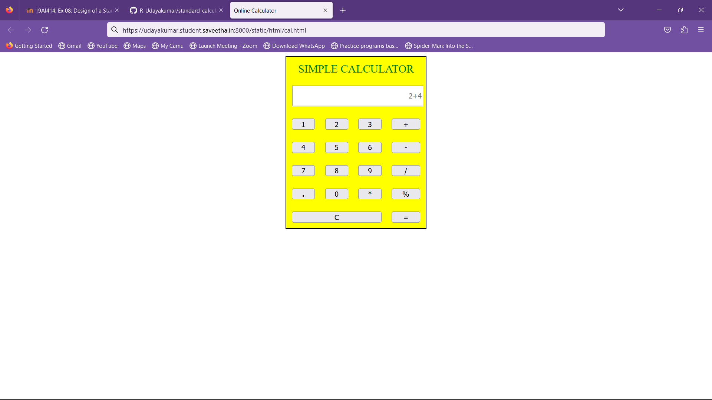
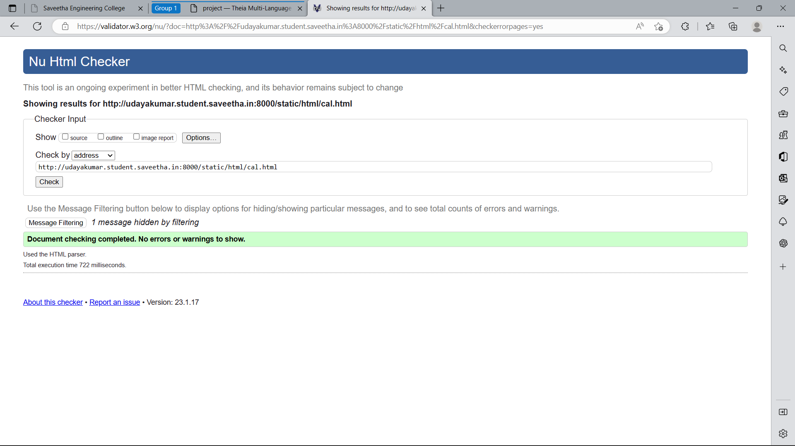

# Design of a Standard Calculator

## AIM:

To design a web application for a standard calculator.

## DESIGN STEPS:
## step 1:
Clone the github repository and create Django admin interface.

## Step 2:
Change settings.py file to allow request from all hosts.

## Step 3:
Use CSS for creating attractive colors.

## Step 4:
Write JavaScript program for implementing five different operations.

## Step 5:
Validate the HTML and CSS code.

## Step 6:
Publish the website in the given URL.

## step 7:
Validate the HTML and CSS code.

## Step 8:
Publish the website in the given URL.
## PROGRAM :
```html

<!DOCTYPE html>
<html>
	<head>
		<title>Online Calculator</title>
		<script>
			function number(value){
				document.form1.result.value += value;
			}
			function cle(value) {
				document.form1.result.value=0;
			}
			function evalua() {
				//var evalu=eval(document.form1.result.value);
				document.form1.result.value=eval(document.form1.result.value);
			}
		</script>
		<style>
			table{
				border: 2px solid black;
				width:20%;
                background:yellow;
				
				
			}
			
			td{
				padding: 20px;
				width:10px;
				height:95%;
                font-size:large ;
				color:green;
			}
			button{
				width:90%;
				height:90%;
				color:black;
				
			}
			input{
				width:100%;
				height:40px;
				background-color:white;
			}
			
			button:hover{
				background-color:green;
				color:black;
				font-weight:Arial;
			}
		</style>
	</head>
	<body>
		<form name="form1">
			<table align="center" >
				<tr><td colspan="4" style="text-align:center">SIMPLE CALCULATOR</td></tr>
				<tr><td colspan="4">
					<input type="text" name="result" placeholder="0" disabled style="text-align:right"></input>
					</td>
				</tr>
				<tr>
					<td><button type="button" onclick="number(value)" value="1">1</button></td>
					<td><button type="button" onclick="number(value)" value="2">2</button></td>
					<td><button type="button" onclick="number(value)" value="3">3</button></td>
					<td><button type="button" onclick="number(value)" value="+">+</button></td>
				</tr>
				<tr>
					<td><button type="button" onclick="number(value)" value="4">4</button></td>
					<td><button type="button" onclick="number(value)" value="5">5</button></td>
					<td><button type="button" onclick="number(value)" value="6">6</button></td>
					<td><button type="button" onclick="number(value)" value="-">-</button></td>
				</tr>
				<tr>
					<td><button type="button" onclick="number(value)" value="7">7</button></td>
					<td><button type="button" onclick="number(value)" value="8">8</button></td>
					<td><button type="button" onclick="number(value)" value="9">9</button></td>
					<td><button type="button" onclick="number(value)" value="/">/</button></td>
				</tr>
				<tr>
					<td><button type="button" onclick="number(value)" value="."><strong>.</strong></button></td>
					<td><button type="button" onclick="number(value)" value="0">0</button></td>
					<td><button type="button" onclick="number(value)" value="*">*</button></td>
					<td><button type="button" onclick="number(value)" value="%">%</button></td>
				</tr>
				<tr>
					<td colspan="3"><button type="button" onclick="cle(value)" value="C">C</button></td>
					<td colspan="3"><button type="button" onclick="evalua()" value='='>= </button></td>
				</tr>
			</table>
		</form>
	</body>
</html>

```
## OUTPUT:

## HTML Validator:


## Result:
Thus,the program for designing a simple calculator using Javascript is executed successfully.

